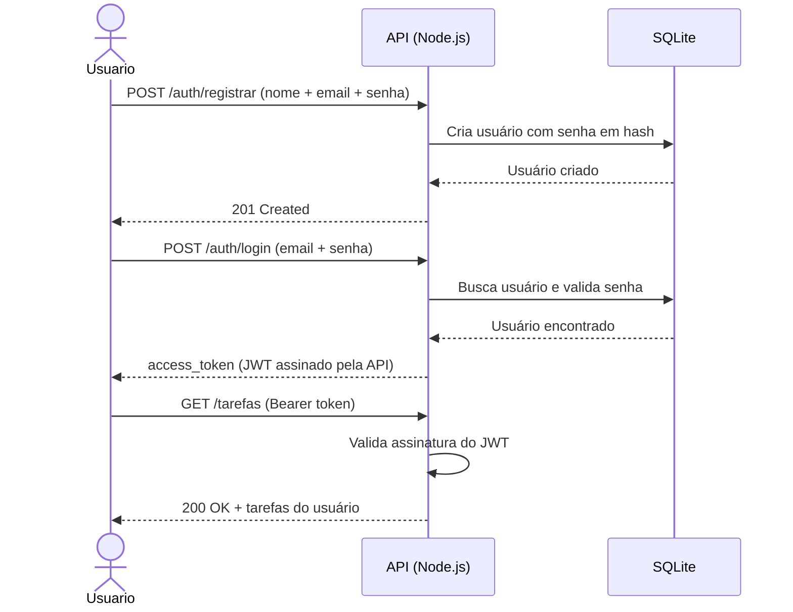
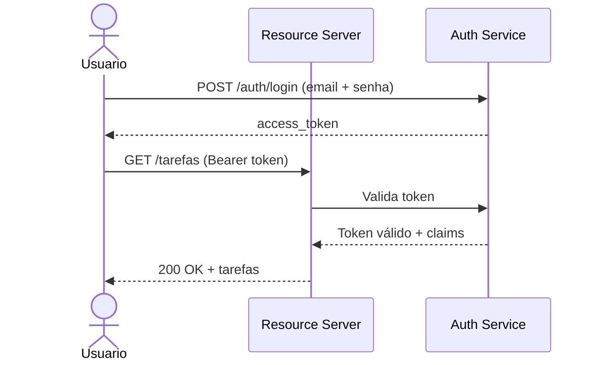
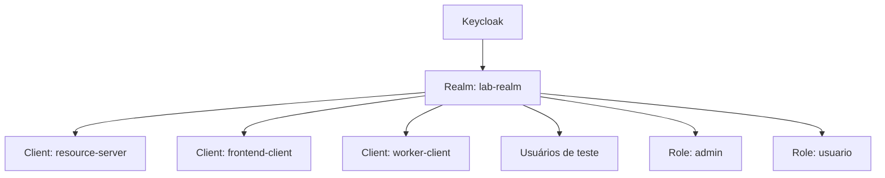
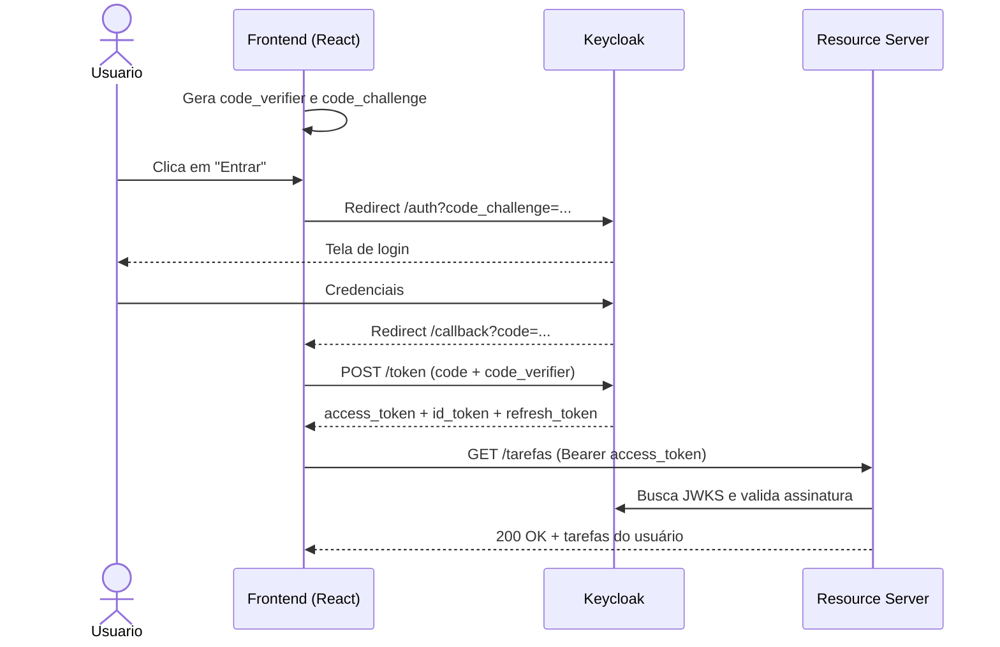
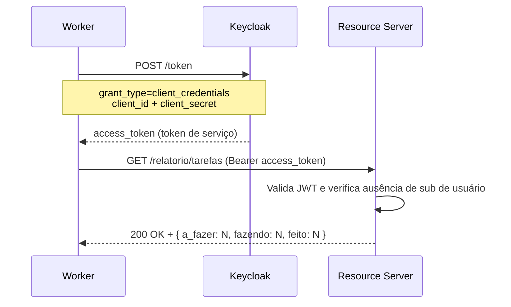
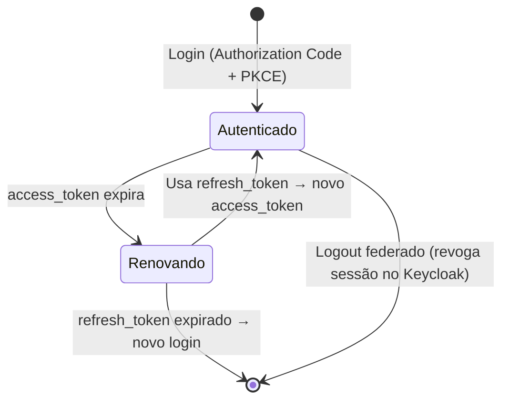

# oauth-keycloak-lab

Projeto de portfólio e estudo prático sobre **OAuth 2.0** e **OpenID Connect (OIDC)**, construído com arquitetura evolutiva: cada fase expõe um problema real que a próxima resolve.

O domínio é um **Task Manager** — simples o suficiente para não desviar o foco, realista o suficiente para justificar roles, escopos e múltiplos tipos de client.

O objetivo não é só fazer funcionar — é entender o porquê de cada decisão, sentindo na prática os problemas que cada fluxo OAuth resolve.

---

## O que você vai aprender

- Por que autenticação acoplada à API de negócio é um problema
- Como extrair responsabilidades de autenticação para um serviço dedicado
- O que é um Identity Provider e qual problema ele resolve
- Como configurar o Keycloak como IdP em ambiente local
- Os conceitos fundamentais de OAuth 2.0 e OpenID Connect
- Como implementar os principais fluxos OAuth:
  - Authorization Code + PKCE (SPA com usuário)
  - Client Credentials (M2M sem usuário)
  - Refresh Token (gestão de sessão e logout federado)
- Como proteger APIs Node.js com tokens JWT via JWKS
- Como consumir uma API protegida a partir de uma SPA React

---

## Stack

| Camada | Tecnologia |
|---|---|
| Runtime | Node.js 24.16.0 LTS |
| Linguagem | TypeScript (ESM) |
| Identity Provider | Keycloak via Docker |
| Backend / Resource Server | Node.js + Express |
| Frontend / Client | React + Vite |
| Banco de dados | SQLite via `node:sqlite` (nativo do Node.js 24) |
| Validação JWT | jose |
| Biblioteca OIDC (frontend) | oidc-client-ts |
| Testes | Vitest (TDD) |
| Linting / Formatação | ESLint + Prettier |
| Documentação de API | OpenAPI (spec-first) + Swagger UI |
| Documentação do projeto | MkDocs + Material (GitHub Pages) |
| Containerização | Docker + Docker Compose |

---

## Modelo de Branches

Cada branch representa um **snapshot completo e independente** de uma fase. Qualquer branch pode ser clonada e executada de forma isolada — sem depender de outra fase.

```
main                              ← documentação geral e ADRs
│
├── fase/1-auth-manual            ← API monolítica com auth acoplada
├── fase/2-auth-service           ← auth-service dedicado + resource-server
├── fase/3-keycloak-setup         ← Keycloak como IdP
├── fase/4-authorization-code-pkce← Authorization Code + PKCE (SPA)
├── fase/5-client-credentials     ← Client Credentials (M2M)
└── fase/6-refresh-token          ← Refresh Token e logout federado
```

Cada branch tem seu próprio `README.md` com contexto do problema, instruções de setup e o que observar.

---

## Roteiro de Fases

### Fase 1 — `fase/1-auth-manual`
**Problema: autenticação acoplada à API de negócio**

O ponto de partida. A API gerencia tudo: cadastro de usuários, validação de senha, emissão de JWT com chave local e proteção de rotas de tarefas.



**O que o leitor vai perceber:** a API acumula responsabilidades que não são dela. Qualquer outro serviço que precisasse autenticar usuários teria que replicar toda essa lógica.

---

### Fase 2 — `fase/2-auth-service`
**Solução parcial: separar a responsabilidade de autenticação**

A autenticação é extraída para um `auth-service` dedicado. O `resource-server` passa a apenas validar tokens — sem conhecer usuários ou senhas.



**O que o leitor vai perceber:** a separação melhora o design, mas o `auth-service` ainda é código que precisa ser mantido — rotação de chaves, armazenamento seguro de senhas, múltiplos clients. Uma solução battle-tested faz mais sentido.

---

### Fase 3 — `fase/3-keycloak-setup`
**Evolução: Keycloak como Identity Provider**

O `auth-service` feito à mão é aposentado. O Keycloak assume como IdP via Docker. O `resource-server` valida tokens via JWKS do Keycloak.



**Endpoints do Keycloak utilizados:**

| Endpoint | Descrição |
|---|---|
| `/.well-known/openid-configuration` | Discovery document |
| `/protocol/openid-connect/token` | Emissão de tokens |
| `/protocol/openid-connect/auth` | Endpoint de autorização (redirect) |
| `/protocol/openid-connect/certs` | JWKS — chaves públicas para validar tokens |
| `/protocol/openid-connect/logout` | Encerramento de sessão |

---

### Fase 4 — `fase/4-authorization-code-pkce`
**Fluxo 1: Authorization Code + PKCE**

O frontend React entra em cena. O usuário é redirecionado ao Keycloak para login e retorna com tokens.



| Token | Quem usa | Para quê |
|---|---|---|
| `id_token` | Frontend | Identidade do usuário (nome, email, claims) |
| `access_token` | Resource Server | Autorizar acesso a recursos protegidos |
| `refresh_token` | Frontend | Renovar o `access_token` sem novo login |

---

### Fase 5 — `fase/5-client-credentials`
**Fluxo 2: Client Credentials (M2M)**

Um `worker` Node.js autentica diretamente no Keycloak com `client_id` + `client_secret`, sem contexto de usuário. Acessa todas as tarefas do sistema e gera um relatório de status agregado.



**Quando usar Client Credentials:** jobs de background, comunicação entre microsserviços, CLIs automatizadas — qualquer cenário sem usuário interativo.

---

### Fase 6 — `fase/6-refresh-token`
**Fluxo 3: Refresh Token e gerenciamento de sessão**

O `access_token` tem vida curta intencionalmente. O `refresh_token` resolve isso sem forçar um novo login a cada expiração.



| Tipo de logout | O que faz | Resultado |
|---|---|---|
| Local | Remove token do estado da SPA | Outros clients continuam logados |
| Federado | Chama `end_session_endpoint` do Keycloak | Encerra sessão em todos os clients |

---

## Qualidade e CI/CD

O projeto é desenvolvido com **TDD** — todo código é precedido pelo teste. Dois pipelines automatizados no GitHub Actions garantem a integridade de cada fase:

| Pipeline | Quando executa | O que faz |
|---|---|---|
| `ci.yml` | Todo push em `fase/*` e PRs | Lint + formatação + testes unitários/integração + validação OpenAPI |
| `e2e.yml` | Merge para `main` e manual | Testes E2E com Keycloak via Docker |

---

## Documentação

- **GitHub Pages:** visão geral, narrativa das fases, ADRs e glossário OAuth/OIDC — gerados com MkDocs + Material
- **OpenAPI:** especificação de cada fase em `docs/openapi/openapi.yaml`, visualizável via Swagger UI local
- **HTTP files:** arquivos `.http` e collection Postman em `docs/http/` para reproduzir todos os fluxos

---

## Glossário

| Termo | Descrição |
|---|---|
| **OAuth 2.0** | Framework de autorização que permite que um app acesse recursos em nome de um usuário |
| **OIDC** | Camada de identidade sobre OAuth 2.0 — adiciona autenticação e o `id_token` |
| **Identity Provider (IdP)** | Serviço responsável por autenticar usuários e emitir tokens |
| **Authorization Server** | O servidor que emite tokens dentro do fluxo OAuth |
| **Resource Server** | A API que consome e valida tokens |
| **Client** | A aplicação que solicita acesso (SPA, serviço, CLI) |
| **Access Token** | Token de curta duração que autoriza acesso a recursos |
| **ID Token** | JWT com claims de identidade do usuário (exclusivo do OIDC) |
| **Refresh Token** | Token de longa duração usado para renovar o access token |
| **PKCE** | Extensão de segurança para o Authorization Code Flow em clients públicos |
| **Scope** | Permissões que o client solicita ao Authorization Server |
| **Claim** | Atributo no payload de um JWT (ex: `sub`, `email`, `roles`) |
| **JWKS** | Conjunto de chaves públicas do Authorization Server para verificar assinaturas |
| **Realm** | Unidade de isolamento no Keycloak (agrupa usuários, clients e configurações) |
| **Grant Type** | O tipo de fluxo OAuth sendo utilizado |

---

## Referências

- [OAuth 2.0 — RFC 6749](https://datatracker.ietf.org/doc/html/rfc6749)
- [OpenID Connect Core Spec](https://openid.net/specs/openid-connect-core-1_0.html)
- [OAuth 2.0 Simplified — Aaron Parecki](https://www.oauth.com/)
- [Keycloak Documentation](https://www.keycloak.org/documentation)
- [jose — documentação oficial](https://github.com/panva/jose)
- [oidc-client-ts — documentação oficial](https://github.com/authts/oidc-client-ts)
- [jwt.io](https://jwt.io) — inspecionar e decodificar JWTs
