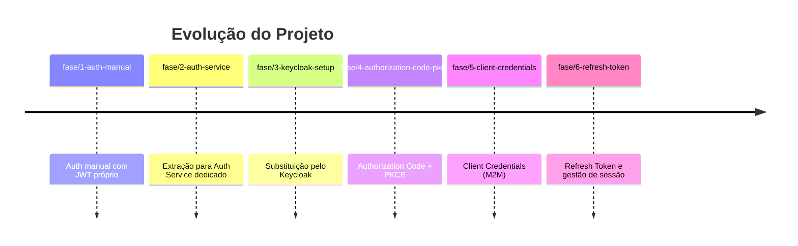
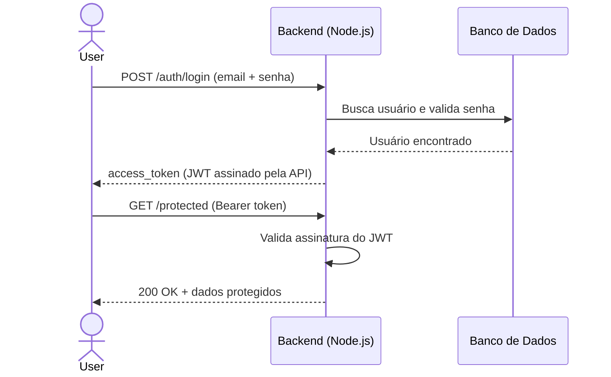
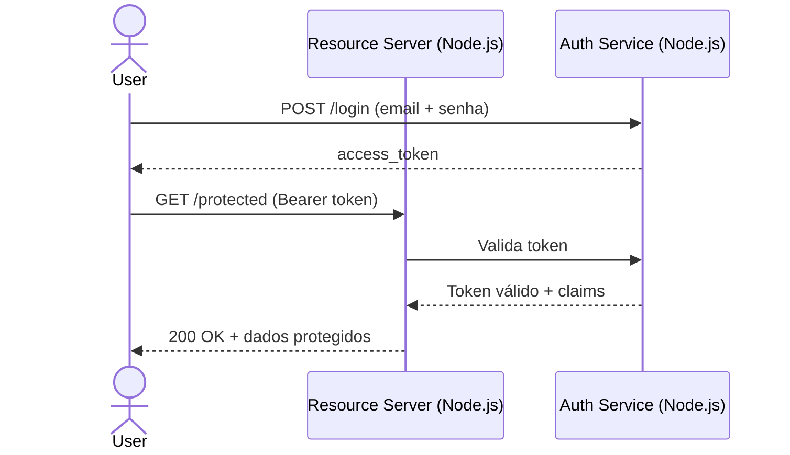
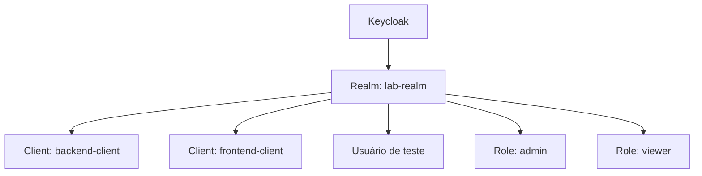
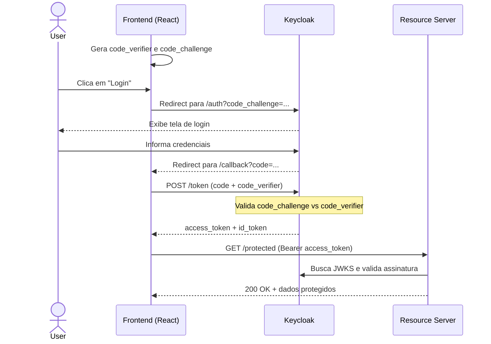
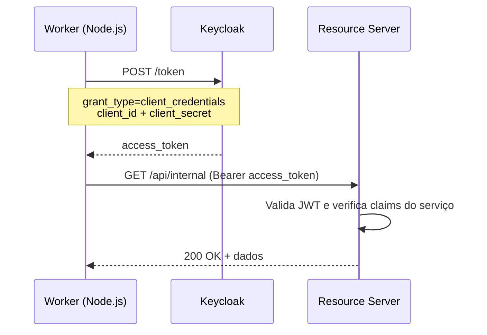
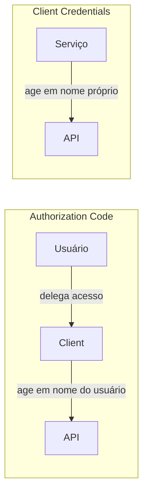
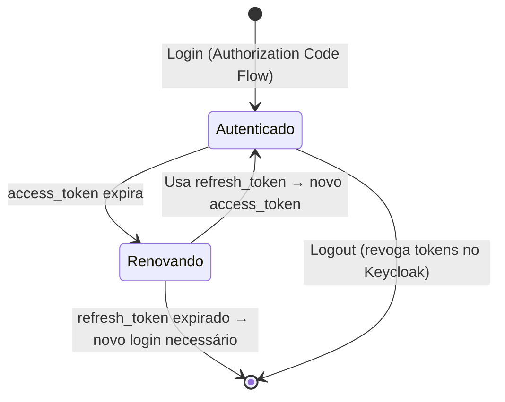

# 🔐 oauth-keycloak-lab

Projeto de estudo prático sobre **OAuth 2.0** e **OpenID Connect (OIDC)**, construído com uma abordagem de **arquitetura evolutiva**: começamos com autenticação implementada manualmente e evoluímos até um Identity Provider dedicado com os principais fluxos OAuth.

O objetivo não é só fazer funcionar — é **entender o porquê de cada decisão**, sentindo na prática os problemas que cada evolução resolve.

---

## 🎯 O que você vai aprender

- Por que delegar autenticação para um serviço dedicado
- O que é um Identity Provider e qual problema ele resolve
- Como configurar o **Keycloak** como IdP em ambiente local
- Os conceitos fundamentais de **OAuth 2.0** e **OpenID Connect**
- Como implementar e testar os principais fluxos OAuth:
  - Authorization Code + PKCE (SPA)
  - Client Credentials (M2M)
  - Refresh Token (gerenciamento de sessão)
- Como proteger APIs Node.js com tokens JWT
- Como consumir uma API protegida a partir de uma SPA React

---

## 🧰 Stack

| Camada | Tecnologia |
|---|---|
| Identity Provider | [Keycloak](https://www.keycloak.org/) via Docker |
| Backend / Resource Server | Node.js + Express |
| Frontend / Client | React + Vite |
| Biblioteca OIDC (frontend) | [oidc-client-ts](https://github.com/authts/oidc-client-ts) |
| Validação JWT (backend) | [jose](https://github.com/panva/jose) |
| Containerização | Docker + Docker Compose |

---

## 🌿 Modelo de Branches

Cada branch representa um **snapshot completo e funcional** de uma fase do projeto. Você pode fazer checkout de qualquer branch e ter o ambiente rodando de forma independente, sem depender da ordem de evolução.

```
main
│
├── fase/1-auth-manual
├── fase/2-auth-service
├── fase/3-keycloak-setup
├── fase/4-authorization-code-pkce
├── fase/5-client-credentials
└── fase/6-refresh-token
```

> Cada branch possui seu próprio `README.md` com instruções de setup e os conceitos específicos daquela fase.

---

## 🗺️ Roteiro de Fases

### Visão Geral da Evolução



---

### Fase 1 — `fase/1-auth-manual`
**Auth implementada na mão**

O ponto de partida. Nessa fase a autenticação existe dentro da própria API: a aplicação gerencia usuários, valida senhas e emite seus próprios JWTs.

**O que você vai construir:**
- Endpoint `POST /auth/register` e `POST /auth/login`
- Geração de JWT assinado com chave local
- Middleware de autenticação que valida esse JWT
- Rota protegida que retorna dados do usuário autenticado

**Arquitetura desta fase:**



**Por que isso é um problema:**
Ao final desta fase você vai perceber os limites dessa abordagem — a API acumula responsabilidades que não são dela: gerenciar usuários, senhas, sessões, emitir tokens. Qualquer outro serviço que precise autenticar usuários teria que replicar toda essa lógica.

---

### Fase 2 — `fase/2-auth-service`
**Extração para um Auth Service dedicado**

A responsabilidade de autenticação é extraída para um serviço separado. A API principal deixa de conhecer usuários e passa a apenas validar tokens emitidos pelo Auth Service.

**O que você vai construir:**
- Um serviço Node.js dedicado (`auth-service`) responsável por login e emissão de tokens
- A API principal (`resource-server`) que só valida tokens, sem saber de usuários
- Comunicação entre os dois serviços

**Arquitetura desta fase:**



**O que você vai perceber:**
Essa separação já é uma melhora real. Mas o Auth Service ainda é um código que você mantém — e com isso vêm problemas como: rotação de chaves, armazenamento seguro de senhas, suporte a múltiplos clients, MFA, etc. Chega um ponto em que faz mais sentido usar uma solução battle-tested. É aí que o Keycloak entra.

---

### Fase 3 — `fase/3-keycloak-setup`
**Substituição pelo Keycloak**

O Auth Service feito à mão é aposentado. O Keycloak assume como Identity Provider. O Resource Server continua o mesmo, mas agora valida tokens emitidos pelo Keycloak.

**O que você vai construir:**
- Keycloak rodando via Docker Compose
- Realm, Client e usuários de teste configurados
- Resource Server atualizado para validar tokens via JWKS do Keycloak
- Scripts ou collection HTTP para testar o fluxo de login diretamente

**Configuração do Keycloak:**



**Endpoints importantes que o Keycloak expõe:**

| Endpoint | Descrição |
|---|---|
| `/.well-known/openid-configuration` | Discovery document com todos os endpoints |
| `/protocol/openid-connect/token` | Emissão de tokens |
| `/protocol/openid-connect/auth` | Endpoint de autorização (redirect) |
| `/protocol/openid-connect/userinfo` | Informações do usuário autenticado |
| `/protocol/openid-connect/certs` | JWKS — chaves públicas para validar tokens |
| `/protocol/openid-connect/logout` | Encerramento de sessão |

---

### Fase 4 — `fase/4-authorization-code-pkce`
**Authorization Code Flow + PKCE**

O fluxo principal para aplicações públicas (SPAs e apps mobile). O frontend React entra em cena para demonstrar o fluxo completo com redirecionamento para o Keycloak.

**O que você vai construir:**
- Frontend React com botão de login que redireciona para o Keycloak
- Página de callback que processa o retorno do Keycloak
- Exibição das informações do usuário (claims do `id_token`)
- Consumo da rota protegida do Resource Server com o `access_token`

**Por que PKCE?**

O PKCE (_Proof Key for Code Exchange_) resolve um problema específico de clients públicos: como garantir que quem trocou o `authorization_code` por um token é o mesmo client que iniciou o fluxo, se não há como guardar um `client_secret` com segurança?



**O papel de cada token:**

| Token | Quem usa | Para quê |
|---|---|---|
| `id_token` | Frontend | Saber quem é o usuário (nome, email, claims) |
| `access_token` | Resource Server | Autorizar acesso a recursos protegidos |
| `refresh_token` | Frontend | Renovar o `access_token` sem novo login |

---

### Fase 5 — `fase/5-client-credentials`
**Client Credentials Flow**

O fluxo para comunicação máquina-a-máquina (M2M). Não há usuário envolvido — um serviço se autentica diretamente no Keycloak usando suas próprias credenciais.

**O que você vai construir:**
- Um segundo client no Keycloak (`service-client`) do tipo confidential
- Um serviço Node.js (`worker`) que busca um token via Client Credentials
- Uma rota no Resource Server acessível apenas por service clients
- Validação de claims específicos para distinguir tokens de usuário de tokens de serviço

**Quando usar:**
- Jobs e workers que rodam sem interação do usuário
- Comunicação entre microsserviços
- CLIs e scripts automatizados



**Diferença em relação ao Authorization Code:**



---

### Fase 6 — `fase/6-refresh-token`
**Refresh Token e Gerenciamento de Sessão**

O `access_token` tem vida curta intencionalmente. O `refresh_token` resolve isso sem forçar um novo login a cada expiração.

**O que você vai construir:**
- Silent refresh no frontend: renovação automática do token antes de expirar
- Logout federado: invalidar sessão no Keycloak, não só localmente
- Demonstração de que um token revogado é rejeitado pelo Resource Server

**Ciclo de vida dos tokens:**



**Logout local vs. logout federado:**

| Tipo | O que faz | Resultado |
|---|---|---|
| **Local** | Remove token do estado da SPA | Outros clients continuam logados |
| **Federado** | Chama `end_session_endpoint` do Keycloak | Encerra sessão em todos os clients |

---

## 🧩 Glossário

| Termo | Descrição |
|---|---|
| **OAuth 2.0** | Framework de *autorização* que permite que um app acesse recursos em nome de um usuário |
| **OIDC** | Camada de *identidade* sobre OAuth 2.0 — adiciona autenticação e o `id_token` |
| **Identity Provider (IdP)** | Serviço responsável por autenticar usuários e emitir tokens (ex: Keycloak) |
| **Authorization Server** | O servidor que emite tokens dentro do fluxo OAuth |
| **Resource Server** | A API que consome e valida tokens |
| **Client** | A aplicação que solicita acesso (SPA, serviço, CLI) |
| **Access Token** | Token de curta duração que autoriza acesso a recursos |
| **ID Token** | JWT com claims de identidade do usuário (exclusivo do OIDC) |
| **Refresh Token** | Token de longa duração usado para renovar o access token |
| **PKCE** | Extensão de segurança para o Authorization Code Flow em clients públicos |
| **Scope** | Permissões que o client solicita ao Authorization Server (ex: `openid profile email`) |
| **Claim** | Atributo no payload de um JWT (ex: `sub`, `email`, `roles`) |
| **JWKS** | Conjunto de chaves públicas do Authorization Server para verificar assinaturas de tokens |
| **Realm** | Unidade de isolamento no Keycloak (agrupa usuários, clients e configurações) |
| **Grant Type** | O tipo de fluxo OAuth sendo utilizado |

---

## 📚 Referências

- [OAuth 2.0 Simplified — Aaron Parecki](https://www.oauth.com/) — melhor recurso introdutório
- [An Illustrated Guide to OAuth and OpenID Connect — Okta](https://developer.okta.com/blog/2019/10/21/illustrated-guide-to-oauth-and-oidc)
- [OAuth 2.0 — RFC 6749](https://datatracker.ietf.org/doc/html/rfc6749)
- [OpenID Connect Core Spec](https://openid.net/specs/openid-connect-core-1_0.html)
- [Keycloak Documentation](https://www.keycloak.org/documentation)
- [jwt.io](https://jwt.io) — inspecionar e decodificar JWTs manualmente
